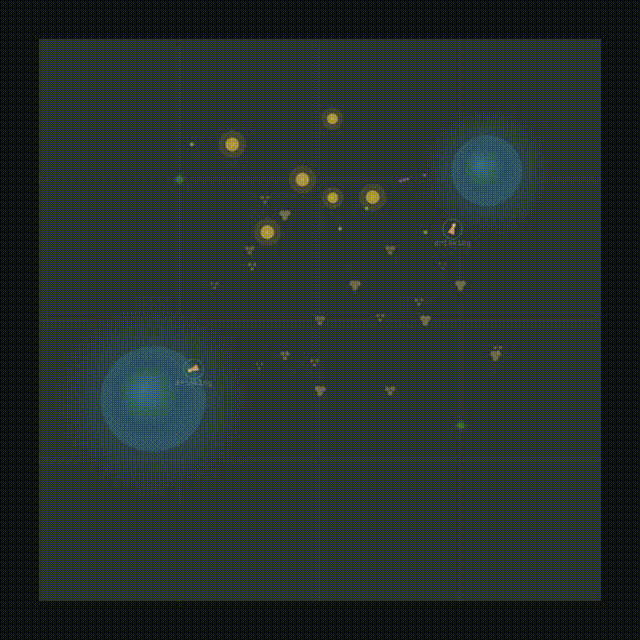
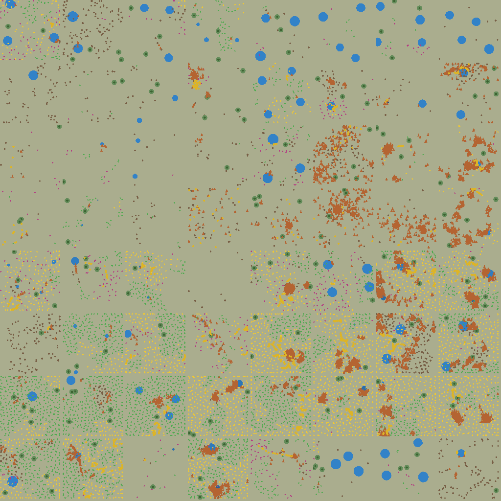

<!-- 
  līlā — BYOM Ecosystem Simulation Engine
  Copyright 2025 BioSynthArt Studios LLC
  Licensed under the Apache License, Version 2.0
  https://github.com/hellolifeforms/lila
-->

# līlā

[](https://github.com/hellolifeforms/lila/actions/workflows/test.yml)

*A BYOM ecosystem simulation engine.*

līlā is an open-source engine that grows autonomous ecosystems from
simple rules. You define a world — species, biome, soil, water — and
the engine handles ecology, physics, behavior, and population dynamics.
Nothing is scripted. Everything emerges.

> **What you see right now is a 2D debug visualizer** — a window into
> the engine's state, not the final form. The engine is the product:
> a headless simulation server that streams tick packets over WebSocket
> to any client. The included browser viz shows entity positions, states,
> and soil moisture on a flat canvas. A 3D Godot client with skeletal
> animation is planned for v0.1.0. The thesis isn't pretty graphics —
> it's that tiny ML models, invisible to the user, make a world feel
> alive. See ["The Unseen Hand"](https://postcorporate.substack.com/p/the-unseen-hand)
> for the full argument.

<!-- TODO: Replace with actual GIF of browser viz running -->


---

## What is this?

līlā grows living ecosystems from simple rules. You define a world —
a meadow with deer, butterflies, oak trees, wildflowers — and the
engine handles everything else: hunger and thirst cycles, grazing and
pollination chains, soil nutrient flows, water source depletion,
population dynamics, dormancy and recovery. Organisms don't follow
scripts. Their behavior emerges from continuous state variables,
discrete state machines with hysteresis, and environmental feedback.

The engine is **BYOM** — Bring Your Own Model. A pluggable adapter
system lets you swap in your own ML models for motion, behavior, and
(eventually) narrative intelligence. Three built-in adapters ship with
the framework: a reference MLP, a hand-tuned static mapping, and a
random generator for testing. No model is required — the simulation
runs fine without one.

The name [līlā](https://www.embodiedphilosophy.com/what-is-lila/) 
comes from the Sanskrit word that translates to — the spontaneous, 
purposeless creative unfolding of reality. There's no win condition. 
The world plays as itself.

## Quick start

```bash
git clone https://github.com/hellolifeforms/lila.git
cd lila/deploy/compose
docker compose up --build
```

Open **http://localhost:8001** in your browser. The ecosystem is already running.

You'll see a temperate meadow: deer grazing, butterflies pollinating
wildflowers, oak trees anchoring the landscape, soil moisture shifting
as organisms drink and plants draw water. The simulation runs at 10 Hz
on the server; the browser visualizer interpolates at 60 fps.

**Controls:**
- **☔ Rain** — click the rain button (bottom-right) to trigger rainfall
  and replenish soil moisture. Watch dormant plants revive.
- **⏺ Record** — click to capture a 10-second WebM clip of the
  simulation. Convert to GIF with ffmpeg:
  ```bash
  ffmpeg -i lila-recording.webm -vf "fps=15,scale=480:-1" -loop 0 docs/assets/demo.gif
  ```

To stop: `docker compose down`

## How it works

```
    Browser / Godot client
           │
           │ WebSocket (tick packets at 10 Hz)
           │
    ┌──────▼───────┐
    │   Worker     │  One per active ecosystem
    │   HTTP + WS  │  Serves viz + streams ticks
    └──────┬───────┘
           │
    ┌──────▼───────────────────────────────────┐
    │   ecosim (Python, stdlib only)           │
    │                                          │
    │   engine ─── hybrid automaton            │
    │              flow equations + guards     │
    │              hysteresis on transitions   │
    │                                          │
    │   traits ── species as trait vectors     │
    │             allometric derivation        │
    │             interaction templates        │
    │                                          │
    │   adapters ─ BYOM motor models           │
    │              mlp / static / random       │
    │              ...or bring your own        │
    │                                          │
    │   voxels ─── sparse 3D grid (5 layers)   │
    │              nutrients_fast, slow,       │
    │              moisture, temperature,      │
    │              organic matter              │
    └──────────────────────────────────────────┘
```

Each tick, the engine runs seven phases: continuous flow updates,
entity interactions, guard condition checks (with hysteresis to prevent
oscillation), voxel layer effects, motor model inference, removals,
and spawns. The result is a delta-encoded tick packet streamed to
the client over WebSocket.

The engine has **zero external dependencies** — stdlib Python only.
The worker adds `websockets`. That's the entire server.

## Bring Your Own Model

The simulation engine handles physics and ecology. Models handle
intelligence. The adapter system defines a clean socket where they
meet.

```python
from ecosim.engine import EcosystemEngine
from ecosim.adapters import create_adapter

# Reference MLP (pure Python, ~500 params)
engine = EcosystemEngine(world, adapters={
    "motor": create_adapter("mlp", seed=42),
})

# Pre-trained weights
engine = EcosystemEngine(world, adapters={
    "motor": create_adapter("mlp", weights="weights/motion_v1.json"),
})

# No model at all — simulation still works
engine = EcosystemEngine(world)
```

A custom adapter implements three methods (though context_spec_for can 
just delegate to context_spec if you don't need type-specific inputs):

```python
class MyMotorAdapter:
    def context_spec(self) -> ContextSpec:
        """What inputs your model needs."""
        ...

    def context_spec_for(self, entity_type: str) -> ContextSpec:
        """Type-specific inputs. Defaults to context_spec()."""
        return self.context_spec()

    def infer(self, contexts: list[list[float]]) -> list[list[float]]:
        """Batch of context vectors → batch of latent vectors."""
        ...
```

The engine builds context vectors from entity state according to your
spec, calls `infer()`, and writes the latent vectors back to entities.
Your model could be a neural network, an ONNX runtime, a REST call to
a cloud endpoint, or a lookup table. The engine doesn't care.

Three model levels are defined:

| Level     | Cadence       | What it does                           | Status          |
|-----------|---------------|----------------------------------------|-----------------|
| Motor     | every tick    | Drives animation style via latent vectors | **implemented** |
| Behavior  | every tick    | Influences state transition decisions  | designed, not yet wired |
| Narrative | every N ticks | Shapes macro-scale ecosystem dynamics  | designed, not yet wired |

See [docs/model_adapter_spec.md](docs/model_adapter_spec.md) for the
full guide to building your own adapter.

## Use cases

**Education** — watch ecological principles emerge in real-time.
Predator-prey dynamics, nutrient cycling, competitive exclusion —
experienced, not memorized.

**Game development** — plug lifelike ecosystem behavior into your
world. The BYOM adapter system lets you bring your own motion and
behavior models trained on your animation data.

**Research** — run controlled ecosystem experiments at scale.
Reproducible seeds, configurable biomes, exportable event logs
and population data.

**Creative exploration** — just watch. There's no win condition.
The world plays as itself.

**Artificial life research** — an ASAL-compatible substrate with
ecological semantics. Search for interesting ecosystems using
foundation models, not hand-tuning.

## The 0.1-alpha ecosystem

The current demo runs a temperate meadow with **eight species defined via trait vectors**:

| Species      | Type   | Role                                     |
|--------------|--------|------------------------------------------|
| Deer         | ANIMAL | Grazer, seeks grass → flowers → water → mates |
| Butterfly    | INSECT | Pollinator, seeks fruiting wildflowers          |
| Oak tree     | TREE   | Anchors the scene, creates shade and nutrient gradients |
| Meadow grass | PLANT  | Ground cover, fast-growing grazing target |
| Wildflower   | PLANT  | Blooms when healthy, attracts butterflies |
| Wolf         | ANIMAL | Predator — completes food chain (grass → deer → wolf) |
| Songbird     | BIRD   | Insectivore + frugivore — new trophic niche |
| Mushroom     | MICROORGANISM | Decomposer — closes the nutrient loop |

All species behavior is **derived from functional traits** using allometric scaling laws (Kleiber's Law, metabolic theory of ecology). Adding a new species requires only a JSON trait vector — no engine code changes. Interaction templates (herbivory, predation, pollination, decomposition) handle the combinatorics automatically.

Three interaction chains emerge without scripting:

- **Grazing loop** — deer hunger rises → deer forages toward nearest grass →
  grass consumed → grass spreads from runners if soil is moist
- **Pollination loop** — wildflower reaches fruiting → butterfly flies to it →
  pollinates → lingers → seeks next flower
- **Water loop** — thirst rises → deer walks to nearest pond → drinks →
  pond level drops → soil moisture falls
- **Stress cascade** — overgrazing → grass dies back → deer eat wildflowers →
  no flowers left → butterflies lose food → butterflies cluster at ponds →
  ponds dry up → everything collapses
- **Dormancy & recovery** — plants die back to dormant root systems →
  user triggers rainfall → soil moisture rises → roots detect moisture →
  plants regrow from the same locations

## Project structure

```
lila/
├── server/
│   ├── ecosim/              # Core simulation (stdlib only)
│   │   ├── engine.py        # Hybrid automaton
│   │   ├── entities.py      # Entity schemas
│   │   ├── biome.py         # Biome presets
│   │   ├── voxel_manager.py # Sparse 3D grid
│   │   ├── model_adapter.py # BYOM protocol
│   │   ├── worker.py        # WebSocket server
│   │   └── adapters/        # Built-in motor models
│   ├── examples/            # Demo world definitions
│   └── tests/
├── search/
│   ├── lila_search/         # ASAL-compatible search (see below)
│   │   ├── substrate.py     # Init/Step/Render protocol
│   │   ├── renderer.py      # Headless PIL renderer
│   │   ├── theta.py         # Parameter space definition
│   │   ├── evaluator.py     # CLIP embedding
│   │   ├── illumination.py  # Diversity-driven GA
│   │   └── viz/atlas.py     # UMAP atlas visualization
│   ├── scripts/             # CLI entry points
│   └── tests/
├── client/
│   ├── browser/             # Canvas-based 2D visualizer
│   └── godot/               # 3D client (in development)
├── training/                # Example ML training pipeline
├── deploy/
│   └── compose/             # Docker Compose (start here)
└── docs/
```

## Background

The project thesis is that the most impactful AI is small, specialized,
and invisible to the user. Not a chatbot, not a copilot — a 500-parameter
network running at 10 Hz, producing a 4-dimensional latent vector that
nobody ever sees, but that drives the difference between an entity that
*moves* and one that *behaves*.

The current 2D visualizer shows the engine state: positions, discrete
states, soil moisture. The Godot client (v0.1.0) will map those latent
vectors to skeletal animation — that's where the thesis becomes visceral.
For now, watch the event log and population dynamics. The intelligence
is already there; the rendering will catch up.

For the full argument, see
["The Unseen Hand"](https://postcorporate.substack.com/p/the-unseen-hand)
on Substack.

## Ecosystem search

līlā is also an [ASAL](https://asal.sakana.ai/)-compatible substrate
for foundation-model-guided ecosystem search. The engine wraps in a
standard Init(θ)/Step(θ)/Render(θ) protocol; a headless renderer
produces frames; CLIP embeds them; a diversity-driven genetic algorithm
discovers maximally varied ecosystem configurations.

The first illumination run searched a 17-dimensional parameter space —
rate multipliers, biome conditions, entity counts, water configuration —
across 64 populations for 100 generations, each rolling out 2000 ticks
with 20 CLIP-embedded frames. The result is a simulation atlas: a map
of ecologically distinct worlds discovered by the search, projected
into 2D with UMAP.



Each tile is a different ecosystem found by the search — drought-stressed
sparse worlds, deer population explosions, plant-dominated high-moisture
meadows, balanced mixed communities. None were hand-designed. The search
found them by maximizing diversity in CLIP embedding space.

This is currently rate tuning over five fixed species. The **trait-based architecture** (shipped) enables the next step: θ encodes body masses, diets, and thermal tolerances, and the engine derives behavior allometrically. The search becomes "what organisms produce the most interesting ecologies?" — not "what tuning of the same organisms looks different?" For more on the
connection between ecological substrates and artificial life search, see
["Life as It Could Be"](https://postcorporate.substack.com/p/life-as-it-could-be).

```bash
# Run illumination search
cd search && uv sync
uv run python -m scripts.run_illumination \
    --pop-size 64 --generations 100 --steps 2000 --frames 20 \
    --workers 4 -o results/illuminate
```

See [search/README.md](search/README.md) for setup, output format,
and analysis recipes.

## Roadmap

The engine has transitioned from hand-crafted per-species rules to a **trait-based architecture** using allometric scaling laws. Species are defined as functional trait vectors in JSON — body mass, diet type, metabolic class, locomotion mode — and the engine derives all behavior parameters from established ecological scaling laws (Kleiber's Law, metabolic theory of ecology). Adding a wolf means writing a JSON trait vector, not new Python code.

**Shipped:**
- Trait-based species architecture — body mass → derived behavior via allometric scaling
- Interaction templates — herbivory, predation, pollination, decomposition (parameterized, no per-species code)
- Trait compiler — runs once at init, produces DerivedParams + interaction matrix for the engine
- 8 species defined as trait vectors (deer, butterfly, oak, grass, wildflower, wolf, songbird, mushroom)
- ASAL substrate protocol — Init(θ)/Step(θ)/Render(θ) wrapping ecosim
- Headless renderer for FM-guided evaluation (PIL, 256×256)
- Illumination search — diversity-driven GA with CLIP ViT-B/32
- Simulation atlas — UMAP projection of discovered ecosystems

**Near-term:**
- Two-pool soil nutrient system (fast/slow pools, mineralization, decomposition) — *next*
- Calibration & regression testing (2000-tick baseline comparison)
- Emergent dynamics validation with 8 species (trophic cascades, Lotka-Volterra oscillations)
- Trait-based search — θ encodes organism traits, not just rate multipliers
- Target search — CMA-ES optimization toward text prompts via CLIP

**Medium-term:**
- Searchable physics — allometric exponents as θ dimensions
- Godot 3D client with latent-driven skeletal animation
- Open-ended search — temporal novelty across simulation rollouts

## Contributing

līlā is in early alpha. Contributions welcome — especially:

- **New species** — today: entity metadata + flow equation tuning.
  Soon: a JSON trait vector and the engine derives the rest
- **Motor adapters** — train a model, export weights, share it
- **Biome presets** — new environments with tuned simulation constants
- **Ecological modeling** — allometric scaling, interaction templates,
  soil nutrient dynamics. If you know metabolic theory of ecology,
  there's real work here
- **Client work** — the Godot client needs skeleton rigs, shaders,
  and scene work
- **ALife/search integration** — the ASAL substrate protocol is working.
  Target search, open-ended search, and trait-based θ expansion are next.
  If you've worked with ASAL, Lenia, or similar frameworks, there's real
  work here
- **Bug reports** — the [known issues](docs/lessons_learned.md) are
  documented, but there are certainly more

## Acknowledgments

līlā was co-developed with multiple AI systems:
- **[Pi.dev](https://pi.dev)** — coding agent for implementation, refactoring, and project state tracking
- **[Claude](https://claude.ai)** (Anthropic) — architecture design, simulation tuning, documentation
- **[Qwen3.6-27B-MTP-GGUF](https://github.com/unslothai/unsloth)** via [Unsloth](https://github.com/unslothai/unsloth) — local reasoning and code review

## License

Apache 2.0 — see [LICENSE](LICENSE).

Copyright 2025 BioSynthArt Studios LLC.

Follow the project: [@hellolifeforms](https://bsky.app/profile/hellolifeforms.bsky.social) on Bluesky.
